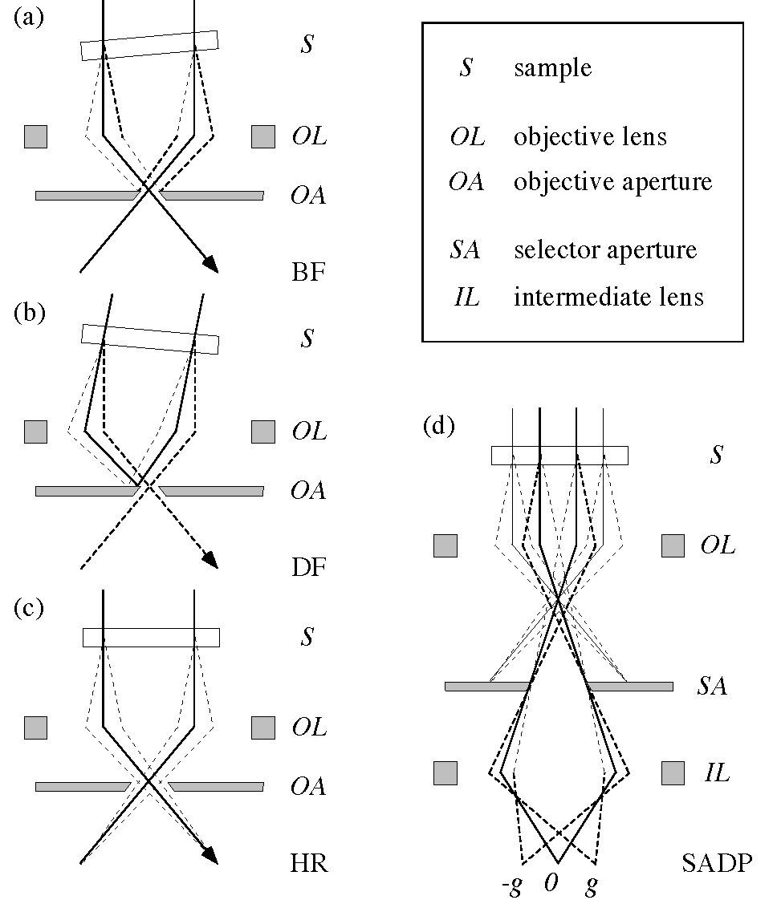
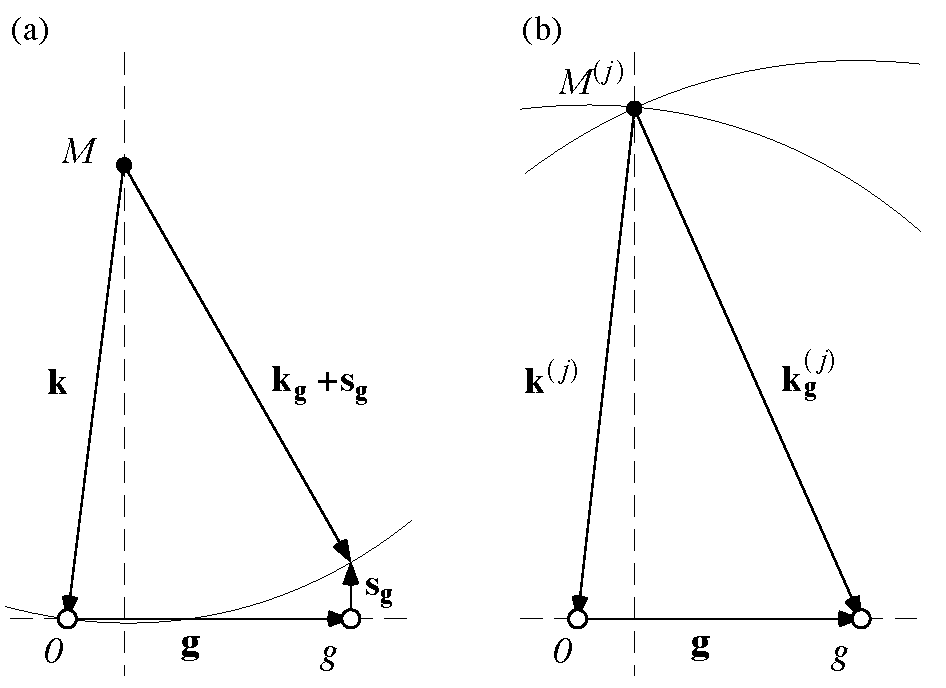
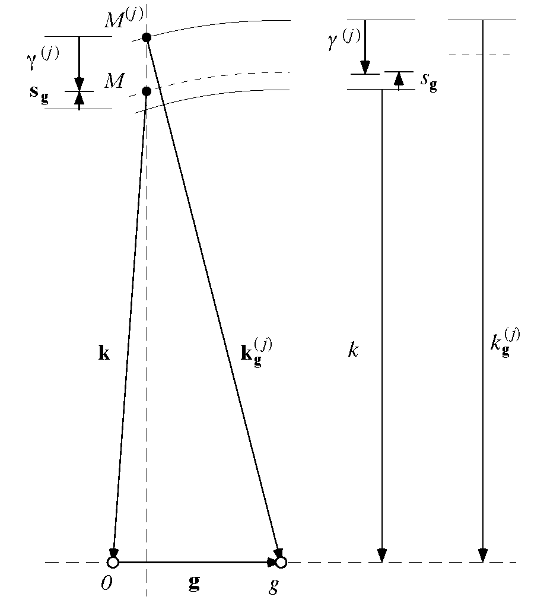
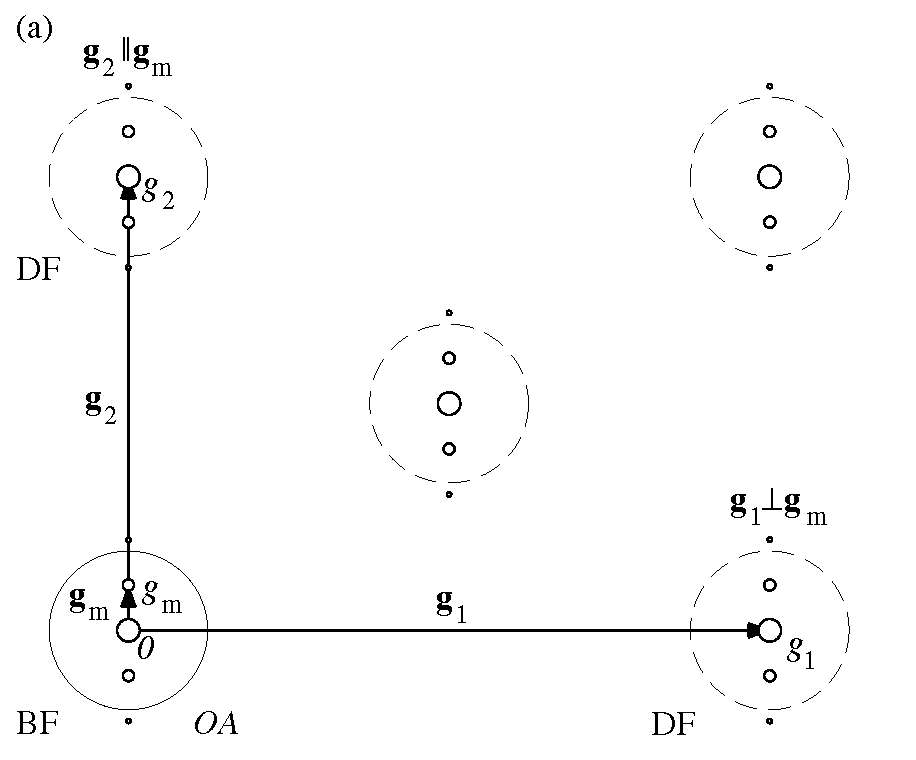

# Diffraction and Imaging of Modulated Alloys

**S. P. Ahrenkiel**
*National Renewable Energy Laboratory, Golden, Colorado 80401*

**REPORT ANALYTICAL MICROSCOPY TEAM**
**11 APRIL 1997**

## Abstract

Transmission electron microscope (TEM) diffraction patterns and images of modulated alloys are discussed. In addition to beams associated with the average crystal matrix, diffraction contrast results from low-frequency Fourier components of the modulated crystal potential that give rise to discrete satellites. We formulate dynamical diffraction from modulated crystals using the Bloch-wave method, and present analytical forms for the modulated crystal alloy potential. We then describe the formation of diffraction patterns and images of modulated alloys in the TEM.

## I. Introduction

High-energy electron diffraction is commonly used by solid-state researchers to investigate the crystallographic properties of thin-film multilayer structures, often containing elemental and compound semiconductors and alloys. The collection of diffracted spot intensities and positions provides a detailed map of the underlying crystal lattice and can reveal periodic chemical or structural modifications. In addition, electron images can be formed using the local variations in the diffracted amplitudes from the constituent materials to produce a direct-space map of the sample. Such analysis is most often accomplished using 100-300 keV electrons transmitted through thin foils in a transmission electron microscope (TEM).

### Electron Optics

The TEM uses electrons emitted from a hot-filament or field-emission source and accelerated to high energy to illuminate a thinned sample. Electromagnetic coils (electron lenses with variable focal length) and apertures (metallic slides with circular bores of various diameter) are used to project the source electrons through a high-vacuum column onto the sample. Focusing occurs in a cylindrically symmetric magnetic field (with axial and radial components) as a result of the radial component of the Lorentz force on charged particles that is proportional to the circular velocity component, with the image generally rotated about the optic axis from the object.

**Figure 1.** Simplified TEM modes: (a) bright-field (BF), (b) tilted dark-field (DF), and (c) high-resolution (HR) lattice imaging. The sample is tilted in BF and tilted DF modes to obtain the Bragg condition. (d) Selected-area diffraction pattern (SADP).

### Diffraction and Imaging

A BF image (Fig. 1) using the reflection $\mathbf{g}$ is usually acquired with a small OA around the transmitted spot $0$, and with the vector $\mathbf{g}$ associated with $\mathbf{g}$ oriented near the Bragg condition. A tilted DF image using $\mathbf{g}$ is usually acquired with the incident beam tilted by the scattering angle so that $\mathbf{g}$ is on the optic axis with $0$ removed by the OA. HR lattice images are usually acquired on high-symmetry zone axes by allowing the interference of $0$ with several low-index reflections.

The diffraction from a particular region of a sample in the plane of the OA can be viewed by positioning a SA in the first image plane and using additional electron optics to produce a SADP. The pattern is often acquired on a low-index zone axis to reveal the crystal symmetry, but can also be viewed off-axis to obtain particular diffraction conditions for BF and DF imaging.

### Computational Methods

Many TEM images are produced using diffraction contrast that results from a set of low-frequency Fourier components associated with a given matrix spot. The Fourier spectrum for an ideal, periodic heterostructure (superlattice) contains a discrete set of non-vanishing components. In [II](#secii), we review dynamical diffraction from perfect crystals, and examine a modified approach that utilizes low-frequency periodicities associated with diffraction satellites. In [III](#seciii), we develop general expressions for the crystal potentials of periodic structures. In [IV](#seciv), we examine the computational methods for the simulation of diffraction patterns and images of perfect crystals and modulated alloys.

## II. Dynamical Diffraction

Our discussion of dynamical diffraction follows that of Reimer (1984) [1]. We produce an approximate Schrödinger-like equation for the high-energy electron wave function $\psi(\mathbf{r})$ in the crystal potential $\Phi(\mathbf{r})$, which is assumed to be unaltered by the incident beam. We obtain Bloch-wave solutions for perfect and modulated crystals, and compute the diffracted amplitudes below thin foil samples using vacuum/sample boundary conditions.

### Quantum-Mechanical Formulation

From special relativity, the motion of a (spinless) high-energy electron in the crystal is described by

$$\sqrt{(\mathbf{p}(\mathbf{r})c)^2+(mc^2)^2} = e[V+\Phi(\mathbf{r})]+mc^2 \tag{1}$$

where $\mathbf{p}(\mathbf{r})$, $m$, and $e$ are the electron momentum, rest mass, and absolute value of charge, respectively, $c$ is the speed of light and $V$ is the accelerating potential. The average kinetic energy in the crystal is $E=e[V+\Phi_0] \approx eV$, where $\Phi_0$ is the average crystal potential (a positive quantity) (III).

We identify the relativistic mass $m'c^2 = E+mc^2$ and reduced kinetic energy $E' = E(m+m')/2m'$. Using a modified potential $\Phi'(\mathbf{r}) = \Phi(\mathbf{r}) - \Phi_0$, we square (1) and expand to lowest order in $e\Phi'(\mathbf{r})/m'c^2$, giving the non-relativistic form

$$p^2(\mathbf{r})/2m' - e\Phi'(\mathbf{r}) = E' \tag{2}$$

From (2), we identify the average electron momentum $p = \hbar k = \sqrt{2m'E'}$ and wavelength $\lambda = 1/k$ in the crystal. We write the crystal structure function $U(\mathbf{r}) = 2m'e\Phi(\mathbf{r})/\hbar^2$. Using the modified form $U'(\mathbf{r}) = U(\mathbf{r}) - U_0$ and the momentum operator $\hat{\mathbf{p}} = -i\hbar\nabla$, we produce the wave equation

$$[\nabla^2 + 4\pi^2 k^2 + U'(\mathbf{r})]\psi(\mathbf{r}) = 0 \tag{3}$$

for an high-energy electron in the crystal.

### Bloch-Wave Solutions

In III, we write the periodic function $\Phi(\mathbf{r})$ in a perfect crystal as a Fourier series with components $\Phi_{\mathbf{g}}$. We now consider Bloch-wave solutions $\psi^{(j)}(\mathbf{r})$ with the full crystal symmetry

$$\psi^{(j)}(\mathbf{r}) = \sum_{\mathbf{g}} \psi_{\mathbf{g}}^{(j)} e^{2\pi i \mathbf{k}_{\mathbf{g}}^{(j)} \cdot \mathbf{r}} \tag{4}$$

with $\mathbf{k}_{\mathbf{g}}^{(j)} = \mathbf{k}^{(j)} + \mathbf{g}$. Identifying the crystal structure factors $U_{\mathbf{g}} = 2m'/\hbar^2 (e\Phi_{\mathbf{g}})$, we use (3) to obtain the conditions

$$[k_{\mathbf{g}}^{(j)2} - k^2]\psi_{\mathbf{g}}^{(j)} = \sum_{\mathbf{h} \neq \mathbf{g}} U_{\mathbf{g}-\mathbf{h}} \psi_{\mathbf{h}}^{(j)} \tag{5}$$

The total wave function is a linear combination of Bloch waves with excitation amplitudes $\varepsilon^{(j)}$, and can be written as a sum of periodic Bloch functions $\Psi^{(j)}(\mathbf{r})$ with wave vectors $\mathbf{k}^{(j)}$

$$\Psi^{(j)}(\mathbf{r}) = \varepsilon^{(j)} \sum_{\mathbf{g}} \psi_{\mathbf{g}}^{(j)} e^{2\pi i \mathbf{g} \cdot \mathbf{r}} \tag{6}$$

$$\Psi(\mathbf{r}) = \sum_j \Psi^{(j)}(\mathbf{r}) e^{2\pi i \mathbf{k}^{(j)} \cdot \mathbf{r}}$$

We also express $\Psi(\mathbf{r})$ in the sample in terms of diffracted-beam amplitudes $\Psi_{\mathbf{g}}(\mathbf{r})$ (with $\mathbf{k}^{(j)} = \mathbf{k} + \boldsymbol{\gamma}^{(j)}$ and $\mathbf{k}_{\mathbf{g}} = \mathbf{k} + \mathbf{g}$)

$$\Psi_{\mathbf{g}}(\mathbf{r}) = \sum_j \varepsilon^{(j)} \psi_{\mathbf{g}}^{(j)} e^{2\pi i (\boldsymbol{\gamma}^{(j)} - \mathbf{s}_{\mathbf{g}}) \cdot \mathbf{r}} \tag{7}$$

$$\Psi(\mathbf{r}) = \sum_{\mathbf{g}} \Psi_{\mathbf{g}}(\mathbf{r}) e^{2\pi i (\mathbf{k}_{\mathbf{g}} + \mathbf{s}_{\mathbf{g}}) \cdot \mathbf{r}}$$

### Reciprocal-Space Constructions

We now examine the reciprocal-space vector relationships using the diffracted-beam and Bloch-wave representations (Fig. 2). The refracted, incident electron wave vector $\mathbf{k}$ and an elastically scattered wave vector $\mathbf{k}_{\mathbf{g}}+\mathbf{s}_{\mathbf{g}}$ both point from the excitation point $M$ to the surface of the Ewald sphere. The excitation error $\mathbf{s}_{\mathbf{g}}$ is a measure of the deviation from the Bragg condition (at which $\mathbf{k} = \mathbf{k}_{\mathbf{g}}$ and $\mathbf{s}_{\mathbf{g}} = 0$) that is oriented by convention along the (entrance) sample surface normal $\mathbf{n}$ (pointing into the sample).

The continuum of Bloch-wave solutions for each value of $\mathbf{k}$ have wave vectors that point from the dispersion surfaces to the reciprocal-space origin. The boundary conditions at the vacuum/crystal interface require continuity of $\Psi(\mathbf{r})$ and $\nabla\Psi(\mathbf{r}) \cdot \mathbf{n}$, selecting a discrete set of excited Bloch-waves having amplitudes $\varepsilon^{(j)} = \psi_0^{(j)*}$, and wave vectors $\mathbf{k}^{(j)}$ with surface tangential components equal to those of $\mathbf{k}$, and requiring that the excitation points $M^{(j)}$ lie on the surface normal containing $M$.

The colinearity of $\boldsymbol{\gamma}^{(j)}$ and $\mathbf{s}_{\mathbf{g}}$ allows us to write the diffracted-beam amplitudes (7) as functions of a coordinate $z$

$$\Psi_{\mathbf{g}}(z) = \sum_j \psi_0^{(j)*} \psi_{\mathbf{g}}^{(j)} e^{2\pi i (\gamma^{(j)} - s_{\mathbf{g}})z} \tag{8}$$

**Figure 2.** Reciprocal-space constructions of diffraction geometry. Electron propagation is described by (a) diffracted beams or (b) Bloch waves. We assume the crystal surface is parallel to $\mathbf{g}$.

**Figure 3.** High-energy approximation.

### Eigenvalue Problem

In high-energy transmission (Laue) electron diffraction, forward-scattered beams (with small $s_{\mathbf{g}}$) are primarily excited by the incident beam. The high-energy approximation (Fig. 3) gives

$$k_{\mathbf{g}}^{(j)2} - k^2 \approx 2k_n(\gamma^{(j)} - s_{\mathbf{g}}) \tag{9}$$

with $k_n = \mathbf{k} \cdot \mathbf{n}$. With (5), and the extinction distance $\xi_{\mathbf{g}} = k_n/U_{\mathbf{g}}$

$$(\gamma^{(j)} - s_{\mathbf{g}})\psi_{\mathbf{g}}^{(j)} = \sum_{\mathbf{h} \neq \mathbf{g}} \frac{1}{2\xi_{\mathbf{g}-\mathbf{h}}} \psi_{\mathbf{h}}^{(j)} \tag{10}$$

We obtain the eigenvalue problem

$$\gamma^{(j)} \boldsymbol{\psi}^{(j)} = \mathbf{A}\boldsymbol{\psi}^{(j)} \tag{11}$$

The eigenvectors $\boldsymbol{\psi}^{(j)}$ have elements $\psi_{\mathbf{g}}^{(j)}$, and the operator $\mathbf{A}$ is a matrix with elements $A_{\mathbf{g},\mathbf{g}} = s_{\mathbf{g}}$ and $A_{\mathbf{g},\mathbf{h}} = 1/(2\xi_{\mathbf{g}-\mathbf{h}})$ ($\mathbf{h} \neq \mathbf{g}$).

### Absorption

The complex potential $\Phi + i\Phi'$ ($\Phi$ and $\Phi'$ real) has structure function $U + iU'$ ($U$ and $U'$ real). Defining $\xi'_{\mathbf{g}} = k_n/U'_{\mathbf{g}}$ and the matrix $\mathbf{A}'$ with elements $A'_{\mathbf{g},\mathbf{h}} = 1/(2\xi'_{\mathbf{g}-\mathbf{h}})$, we obtain the non-Hermitian matrix $\mathbf{A} + i\mathbf{A}'$ ($\mathbf{A}$ and $\mathbf{A}'$ Hermitian) with eigenvalues $\gamma^{(j)} + i\gamma'^{(j)}$ ($\gamma^{(j)}$ and $\gamma'^{(j)}$ real).

Absorption is often weak ($\Phi'/\Phi < 0.1$) [6], and the attenuation can be estimated from first-order perturbation theory with

$$\gamma'^{(j)} = \langle \boldsymbol{\psi}^{(j)} | \mathbf{A}' | \boldsymbol{\psi}^{(j)} \rangle \tag{12}$$

Calculated absorption ratios for various simple crystals are tabulated [6] and can be interpolated for related materials.

### Diffraction Satellites

The preceding derivation can be repeated for crystal potentials containing low-frequency components associated with periodic composition modulations (see III). Discrete satellite spots emerge in association with the solutions to the wave equation (3). The Bloch waves appear as

$$\psi^{(j)}(\mathbf{r}) = \sum_{\mathbf{g},\mathbf{g}_m} \psi_{\mathbf{g}+\mathbf{g}_m}^{(j)} e^{2\pi i \mathbf{k}_{\mathbf{g}+\mathbf{g}_m}^{(j)} \cdot \mathbf{r}} \tag{13}$$

We find the conditions among the $\psi_{\mathbf{g}+\mathbf{g}_m}^{(j)}$

$$[k_{\mathbf{g}+\mathbf{g}_m}^{(j)2} - k^2]\psi_{\mathbf{g}+\mathbf{g}_m}^{(j)} = \sum_{\mathbf{h},\mathbf{h}_m \atop (\mathbf{h}+\mathbf{h}_m \neq \mathbf{g}+\mathbf{g}_m)} U_{\mathbf{g}+\mathbf{g}_m-\mathbf{h}-\mathbf{h}_m} \psi_{\mathbf{h}+\mathbf{h}_m}^{(j)} \tag{14}$$

The high-energy approximation (9) produces the eigenvalue equation (11) in the modulated case, with the excitation error $s_{\mathbf{g}+\mathbf{g}_m}$ and extinction distance $\xi_{\mathbf{g}+\mathbf{g}_m} = k/U_{\mathbf{g}+\mathbf{g}_m}$. The modulated form of the matrix $\mathbf{A}$ increases in size by a factor of $3^2 = 9$ when first-order satellites are included for all reflections and $5^2 = 25$ when second-order satellites are included. Perturbation methods can be used to evaluate weaker reflections using criteria that weigh the combined structure factor and excitation error associated with each reflection [8].

## III. Crystal Potential
The Fourier components of the potential $\Phi(\mathbf{r})$ in perfect crystals and crystal alloys are evaluated (with $V \to \infty$)

$$\Phi_{\mathbf{g}} = \frac{1}{V} \int_{\mathbf{r} \in V} \Phi(\mathbf{r}) e^{-2\pi i \mathbf{g} \cdot \mathbf{r}} d^3r \tag{15}$$

The total potential is a linear combination of atomic (ionic) terms

$$\Phi(\mathbf{r}) = \sum_k \Phi^{(k)}(\mathbf{r}), \quad \Phi_{\mathbf{g}} = \sum_k \Phi_{\mathbf{g}}^{(k)} \tag{16}$$

The Fourier transforms of individual atomic (ionic) potentials are proportional to the electron scattering amplitudes (form factors) [7] with spherical symmetry (i.e. $\varphi^{(k)}(\mathbf{r}) = \varphi^{(k)}(r)$)

$$f^{(k)}(g) = \frac{2\pi m'e}{\hbar^2} \int_{r=0}^{\infty} r^2 \varphi^{(k)}(r) \frac{\sin(2\pi gr)}{2\pi gr} dr \tag{17}$$

We also identify the delta function (with $\Omega \to \infty$)

$$\delta(\mathbf{r}) = \int_{\mathbf{g} \in \Omega} e^{2\pi i \mathbf{g} \cdot \mathbf{r}} d\mathbf{g}^3 \tag{18}$$

### Perfect Crystals

Each atomic (ionic) potential term appears as a convolution

$$\Phi^{(k)}(\mathbf{r}) = \int_{\mathbf{r}' \in V} \varphi^{(k)}(\mathbf{r} - \mathbf{r}') X^{(k)}(\mathbf{r}') d\mathbf{r}'^3 \tag{19}$$

$$\Phi_{\mathbf{g}}^{(k)} = \varphi^{(k)}(\mathbf{g}) X_{\mathbf{g}}^{(k)}$$

We have defined the crystal functions

$$X^{(k)}(\mathbf{r}) = \sum_{n=1}^{N} \delta(\mathbf{r} - \mathbf{r}_n^{(k)}) \tag{20}$$

$$X_{\mathbf{g}}^{(k)} = \frac{1}{Nv} \sum_{n=1}^{N} e^{-2\pi i \mathbf{g} \cdot \mathbf{r}_n^{(k)}}$$

where $v$ is the unit-cell volume, and the sums are over $n=1..N$ (with $N \to \infty$) equivalent lattice points labeled $n$ (i.e. $e^{2\pi i \mathbf{g} \cdot \mathbf{r}_n} = 1$ for reciprocal-lattice vectors $\mathbf{g}$), and with $\mathbf{r}_n^{(k)} = \mathbf{r}_n + \mathbf{d}^{(k)}$, where the $\mathbf{d}^{(k)}$ are unit-cell positions of ions $k$. From (19) and (20)

$$\Phi^{(k)}(\mathbf{r}) = \sum_{n=1}^{N} \varphi^{(k)}(\mathbf{r} - \mathbf{r}_n^{(k)}) \tag{21}$$

$$\Phi_{\mathbf{g}}^{(k)} = \frac{1}{Nv} \sum_{n=1}^{N} \varphi^{(k)}(\mathbf{g}) e^{-2\pi i \mathbf{g} \cdot \mathbf{r}_n^{(k)}}$$

The potentials are also written as Fourier series

$$\Phi^{(k)}(\mathbf{r}) = \sum_{\mathbf{g}} \Phi_{\mathbf{g}}^{(k)} e^{2\pi i \mathbf{g} \cdot \mathbf{r}} \tag{22}$$

The summation is taken over reciprocal-lattice vectors $\mathbf{g}$.

### Crystal Alloys

We now extend the methods of the previous section to crystal alloys (compounds with chemical substitutions), with

$$\Phi^{(k)}(\mathbf{r}) = \int_{\mathbf{r}' \in V} \varphi^{(k)}(\mathbf{r} - \mathbf{r}') Y^{(k)}(\mathbf{r}') d\mathbf{r}'^3 \tag{23}$$

$$\Phi_{\mathbf{g}}^{(k)} = \varphi^{(k)}(\mathbf{g}) Y_{\mathbf{g}}^{(k)}$$

The composition and displacement functions $x^{(k)}(\mathbf{r})$ and $\mathbf{R}^{(k)}(\mathbf{r})$ for each atom type represent the fractional (virtual) occupancy of a unit-cell site and the shift from that site, respectively, as smooth functions of position. The explicit forms of $x^{(k)}(\mathbf{r})$ and $\mathbf{R}^{(k)}(\mathbf{r})$ depend on the particular materials system under consideration. The crystal-alloy functions are

$$Y^{(k)}(\mathbf{r}) = x^{(k)}(\mathbf{r} - \mathbf{R}^{(k)}(\mathbf{r})) X^{(k)}(\mathbf{r} - \mathbf{R}^{(k)}(\mathbf{r})) \tag{24}$$

Transforming with $\mathbf{r}' = \mathbf{r} - \mathbf{R}(\mathbf{r})$, we make the approximation $d\mathbf{r}'^3 \approx d\mathbf{r}^3$ and write the Fourier transform of (24) as

$$Y_{\mathbf{g}}^{(k)} \approx \frac{1}{V} \int_{\mathbf{r} \in V} x^{(k)}(\mathbf{r}) X^{(k)}(\mathbf{r}) e^{-2\pi i \mathbf{g} \cdot (\mathbf{r} + \mathbf{R}^{(k)}(\mathbf{r}))} d^3r \tag{25}$$

We define a discrete composition variable $x_n^{(k)} = x^{(k)}(\mathbf{r}_n^{(k)})$ and a displacement variable $\mathbf{R}_n^{(k)} = \mathbf{R}^{(k)}(\mathbf{r}_n^{(k)})$. The $Y^{(k)}$ become

$$Y^{(k)}(\mathbf{r}) = \sum_{n=1}^{N} x_n^{(k)} \delta(\mathbf{r} - \mathbf{r}_n^{(k)} - \mathbf{R}_n^{(k)}) \tag{26}$$

$$Y_{\mathbf{g}}^{(k)} = \frac{1}{Nv} \sum_{n=1}^{N} x_n^{(k)} e^{-2\pi i \mathbf{g} \cdot (\mathbf{r}_n^{(k)} + \mathbf{R}_n^{(k)})}$$

Evaluating (23), the potentials are

$$\Phi^{(k)}(\mathbf{r}) = \sum_{n=1}^{N} x_n^{(k)} \varphi^{(k)}(\mathbf{r} - \mathbf{r}_n^{(k)} - \mathbf{R}_n^{(k)}) \tag{27}$$

$$\Phi_{\mathbf{g}}^{(k)} = \frac{1}{Nv} \sum_{n=1}^{N} x_n^{(k)} \varphi^{(k)}(\mathbf{g}) e^{-2\pi i \mathbf{g} \cdot (\mathbf{r}_n^{(k)} + \mathbf{R}_n^{(k)})}$$

The composition variable $x_n^{(k)}$ is zero or one in actual alloys.

### Alloy Functions

We now define modified Fourier components of the potentials that are smoothly varying functions of position

$$\Phi_{\mathbf{g}}^{(k)}(\mathbf{g}_m) = \int_{\mathbf{r} \in V} \Phi_{\mathbf{g}}^{(k)}(\mathbf{r}) e^{-2\pi i \mathbf{g}_m \cdot \mathbf{r}} d^3r \tag{28}$$

where $\mathbf{g}_m$ represents any low-frequency wave vector. The varying potential components are found by

$$\Phi_{\mathbf{g}}^{(k)}(\mathbf{r}) = \int_{\mathbf{r}' \in V} \varphi^{(k)}(\mathbf{r} - \mathbf{r}') Y_{\mathbf{g}}^{(k)}(\mathbf{r}') e^{-2\pi i \mathbf{g} \cdot (\mathbf{r} - \mathbf{r}')} d\mathbf{r}'^3 \tag{29}$$

$$\Phi_{\mathbf{g}}^{(k)}(\mathbf{g}_m) = \varphi^{(k)}(\mathbf{g} + \mathbf{g}_m) Y_{\mathbf{g}}^{(k)}(\mathbf{g}_m)$$

We define the modified displacement and composition functions

$$u^{(k)}(\mathbf{r},\mathbf{g}) = e^{-2\pi i \mathbf{g} \cdot \mathbf{R}^{(k)}(\mathbf{r})} \tag{30}$$

$$x^{(k)}(\mathbf{r},\mathbf{g}) = x^{(k)}(\mathbf{r}) u^{(k)}(\mathbf{r},\mathbf{g})$$

The Fourier transforms are

$$u^{(k)}(\mathbf{g}_m,\mathbf{g}) = \int_{\mathbf{r} \in V} u^{(k)}(\mathbf{r},\mathbf{g}) e^{-2\pi i \mathbf{g}_m \cdot \mathbf{r}} d^3r \tag{31}$$

$$x^{(k)}(\mathbf{g}_m,\mathbf{g}) = \int_{\mathbf{r} \in V} x^{(k)}(\mathbf{r},\mathbf{g}) e^{-2\pi i \mathbf{g}_m \cdot \mathbf{r}} d^3r$$

The modified composition functions have components

$$x^{(k)}(\mathbf{g}_m,\mathbf{g}) = \int_{\mathbf{g}'_m \in \Omega} x^{(k)}(\mathbf{g}_m - \mathbf{g}'_m) u^{(k)}(\mathbf{g}'_m,\mathbf{g}) d\mathbf{g}_m'^3 \tag{32}$$

We transform the modified composition functions as in (24)

$$x'^{(k)}(\mathbf{g}_m,\mathbf{g}) = x^{(k)}(\mathbf{g}_m,\mathbf{g} + \mathbf{g}_m) \tag{33}$$

The direct-space functions are

$$x'^{(k)}(\mathbf{r},\mathbf{g}) = \int_{\mathbf{g}_m \in \Omega} x'^{(k)}(\mathbf{g}_m,\mathbf{g}) e^{2\pi i \mathbf{g}_m \cdot \mathbf{r}} d\mathbf{g}_m^3 \tag{34}$$

The modified crystal-alloy functions are

$$Y_{\mathbf{g}}^{(k)}(\mathbf{r}) = x'^{(k)}(\mathbf{r},\mathbf{g}) X_{\mathbf{g}}^{(k)} \tag{35}$$

$$Y_{\mathbf{g}}^{(k)}(\mathbf{g}_m) = x'^{(k)}(\mathbf{g}_m,\mathbf{g}) X_{\mathbf{g}}^{(k)}$$

The potentials can be written as the Fourier series

$$\Phi^{(k)}(\mathbf{r}) = \sum_{\mathbf{g}} \Phi_{\mathbf{g}}^{(k)}(\mathbf{r}) e^{2\pi i \mathbf{g} \cdot \mathbf{r}} \tag{36}$$

where the sum is over reciprocal-lattice vectors $\mathbf{g}$.

### Modulated Alloys

The modulated (periodic) alloy potentials have components

$$\Phi_{\mathbf{g}+\mathbf{g}_m}^{(k)} = \frac{1}{V} \int_{\mathbf{r} \in V} \Phi^{(k)}(\mathbf{r}) e^{-2\pi i (\mathbf{g} + \mathbf{g}_m) \cdot \mathbf{r}} d^3r \tag{37}$$

which are given by

$$\Phi_{\mathbf{g}+\mathbf{g}_m}^{(k)} = \varphi^{(k)}(\mathbf{g} + \mathbf{g}_m) Y_{\mathbf{g}+\mathbf{g}_m}^{(k)} \tag{38}$$

We consider the arbitrary periodic alloy functions

$$x^{(k)}(\mathbf{r}) = \sum_{\mathbf{g}_m} x_{\mathbf{g}_m}^{(k)} e^{2\pi i \mathbf{g}_m \cdot \mathbf{r}} \tag{39}$$

$$\mathbf{R}^{(k)}(\mathbf{r}) = \sum_{\mathbf{g}_m} \mathbf{R}_{\mathbf{g}_m}^{(k)} e^{2\pi i \mathbf{g}_m \cdot \mathbf{r}}$$

The sums are over the complete set of modulation vectors $\mathbf{g}_m$.

The modified displacement and composition functions become

$$u^{(k)}(\mathbf{r},\mathbf{g}) = \sum_{\mathbf{g}_m} u_{\mathbf{g}_m}^{(k)}(\mathbf{g}) e^{2\pi i \mathbf{g}_m \cdot \mathbf{r}} \tag{40}$$

$$x^{(k)}(\mathbf{r},\mathbf{g}) = \sum_{\mathbf{g}_m} x_{\mathbf{g}_m}^{(k)}(\mathbf{g}) e^{2\pi i \mathbf{g}_m \cdot \mathbf{r}}$$

The components are related by

$$x_{\mathbf{g}_m}^{(k)}(\mathbf{g}) = \sum_{\mathbf{g}'_m} x_{\mathbf{g}_m - \mathbf{g}'_m}^{(k)} u_{\mathbf{g}'_m}^{(k)}(\mathbf{g}) \tag{41}$$

The modified (and translated) composition functions are

$${x'}_{\mathbf{g}_m}^{(k)}(\mathbf{g}) = x_{\mathbf{g}_m}^{(k)}(\mathbf{g} + \mathbf{g}_m) \tag{42}$$

The direct-space functions are

$${x'}^{(k)}(\mathbf{r},\mathbf{g}) = \sum_{\mathbf{g}_m} {x'}_{\mathbf{g}_m}^{(k)}(\mathbf{g}) e^{2\pi i \mathbf{g}_m \cdot \mathbf{r}} \tag{43}$$

We now assume $\mathbf{g} + \mathbf{g}_m \neq \mathbf{g}' + \mathbf{g}'_m$ for $\mathbf{g} \neq \mathbf{g}'$ and $\mathbf{g}_m \neq \mathbf{g}'_m$ (i.e. for all relevant $\mathbf{g}$ and $\mathbf{g}_m$, it holds that $|\mathbf{g}_m| < |\mathbf{g}|$), and write (35) as

$$Y_{\mathbf{g}+\mathbf{g}_m}^{(k)} \approx {x'}_{\mathbf{g}_m}^{(k)}(\mathbf{g}) X_{\mathbf{g}}^{(k)} \tag{44}$$

The modulated potentials become

$$\Phi^{(k)}(\mathbf{r}) = \sum_{\mathbf{g},\mathbf{g}_m} \Phi_{\mathbf{g}+\mathbf{g}_m}^{(k)} e^{2\pi i (\mathbf{g} + \mathbf{g}_m) \cdot \mathbf{r}} \tag{45}$$

These analytical forms are used to generate modulated alloy potentials in local regions of partial crystals (i.e. thin foils).

## IV. Diffraction and Imaging

Electron imaging of crystalline solids is accomplished using electron optics to produce an interference pattern of diffracted beams that presents a direct-space map of the sample structure. Alternatively, the beam amplitudes can be acquired in a diffraction pattern as a discrete set of intensities.

### Diffraction Patterns

The diffracted amplitudes at the bottom of a thin foil of thickness $T$ are obtained from (7) with $z = T$ and written $\Psi_{\mathbf{g}}$. We write the beam amplitudes below the sample as

$$\psi_{\mathbf{g}}(\mathbf{r}) = \Psi_{\mathbf{g}} e^{2\pi i (\mathbf{k}_{\mathbf{g}} + \mathbf{s}_{\mathbf{g}}) \cdot \mathbf{r}} \tag{46}$$

In diffraction experiments, the diffracted beams diverge and are collected without interference. The intensities are measured

$$|\Psi_{\mathbf{g}}|^2 \tag{47}$$

by fitting the diffraction spot profiles to analytical functions.

### Image Formation

In TEM images, the diffracted amplitudes are combined coherently, with phase and amplitude corrections that result from electron optics. With $\Psi'_{\mathbf{g}} = \Psi_{\mathbf{g}} e^{2\pi i s_{\mathbf{g}} T}$, the image intensity is

$$I(\mathbf{r},\Delta f) = \left| \sum_{\mathbf{g}} P(\mathbf{g},\Delta f) \Psi'_{\mathbf{g}} e^{2\pi i \mathbf{g} \cdot \mathbf{r}} \right|^2 \tag{48}$$

The contrast transfer-function for the TEM $P(\mathbf{g},\Delta f)$ is

$$P(\mathbf{g},\Delta f) = O(\mathbf{g}) e^{-i\chi(\mathbf{g},\Delta f) - \chi'(\mathbf{g},\Delta f)} \tag{49}$$

$O(\mathbf{g})$ is a masking function representing the effect of the OA, and $\chi(\mathbf{g},\Delta f)$ and $\chi'(\mathbf{g},\Delta f)$ represent the phase change and damping, respectively, caused by electron optics, and both are functions of the defocus $\Delta f$ (defined here as the difference between the offsets in sample height and focal length).

The phase change results from spherical aberration and defocus of the OL. We define the Scherzer defocus, and a Scherzer wave vector that is inversely proportional to the instrument resolution

$$\Delta f_s = \sqrt{C_s\lambda} \quad g_s = (C_s\lambda^3)^{-1/4} \tag{50}$$

$C_s$ is the coefficient of spherical aberration (typically ~1 mm). The total phase change is found to be [1,4]

$$\chi(\mathbf{g},\Delta f) = \frac{\pi\lambda g^2}{2} \left[ \Delta f - \Delta f_s \left(\frac{g}{g_s}\right)^2 \right] \tag{51}$$

Damping results from incoherence of the incident electron wave function [1,4], and can be written as the sum

$$\chi'(\mathbf{g},\Delta f) = \chi'_c(\mathbf{g}) + \chi'_d(\mathbf{g},\Delta f) \tag{52}$$

Chromatic aberration causes a damping that results from the spread in beam energy and lens current (temporal incoherence)

$$\chi'_c(\mathbf{g}) = \frac{\pi^2}{\lambda^2} \sigma^2 \frac{g^4}{2} \tag{53}$$

where $\sigma$ is the distribution in the defocus (typically 100 Å).

Beam divergence causes a damping that results from the finite condenser aperture size (spatial incoherence)

$$\chi'_d(\mathbf{g},\Delta f) = \frac{\pi^2}{\alpha^2} g^2 \left[ \Delta f - \Delta f_s \left(\frac{g}{g_s}\right)^2 \right]^2 \tag{54}$$

where $\alpha$ is the angle subtended by the incident beam (~0.5 mrad) as determined by the condenser-aperture diameter.

### Modulated Alloys

The beam amplitudes for periodic modulated alloys are

$$\psi_{\mathbf{g}+\mathbf{g}_m}(\mathbf{r}) = \Psi_{\mathbf{g}+\mathbf{g}_m} e^{2\pi i (\mathbf{k}_{\mathbf{g}+\mathbf{g}_m} + \mathbf{s}_{\mathbf{g}+\mathbf{g}_m}) \cdot \mathbf{r}} \tag{55}$$

The diffracted matrix and satellite spot intensities are

$$|\Psi_{\mathbf{g}+\mathbf{g}_m}|^2 \tag{56}$$

With $\Psi'_{\mathbf{g}+\mathbf{g}_m} = \Psi_{\mathbf{g}+\mathbf{g}_m} e^{2\pi i s_{\mathbf{g}+\mathbf{g}_m} T}$, the image intensity becomes

$$I(\mathbf{r},\Delta f) = \left| \sum_{\mathbf{g},\mathbf{g}_m} P(\mathbf{g}+\mathbf{g}_m,\Delta f) \Psi'_{\mathbf{g}+\mathbf{g}_m} e^{2\pi i (\mathbf{g} + \mathbf{g}_m) \cdot \mathbf{r}} \right|^2 \tag{57}$$

The OA placement in the diffraction plane for common TEM imaging modes of a modulated alloy is shown in Fig. 4. The excitation of each reflection changes with sample tilt. $P(\mathbf{g},\Delta f)$ has a strong influence on HR image contrast, but varies only slightly over the small OA used in BF/DF imaging. In addition, BF/DF images can often be simulated using a systematic row.

**Figure 4.** TEM imaging modes for modulated (FCC) crystal alloys. The circles represent the OA placement in the diffraction plane. (a) BF/DF modes. (b) HR mode.

## V. Conclusions

The Bloch-wave method can be applied to periodic structures (superlattices) such as modulated alloys because the Fourier components comprise a discrete set. Localized phenomena such as dislocations and isolated interfaces that involve a continuum of frequencies are not readily studied in this manner. The non-local potential components eliminate the need to invoke the column approximation of electron-diffraction theory and decrease computation times, but simultaneously reduce the scope of the technique to the analysis of periodic structures only.

## References

1. L. Reimer, *Transmission Electron Microscopy*, Springer-Verlag, New York, 1984.
2. N. W. Ashcroft, N. D. Mermin, *Solid State Physics*, Saunders, Philadelphia, 1976.
3. A. Howie, Z. S. Basinski, *Phil. Mag.*, **17**, 1039 (1968).
4. *Electron Diffraction Techniques Vols. I&II*, (ed. J. M. Cowley) Oxford Science, New York 1992.
5. J. C. H. Spence, *Experimental High-Resolution Electron Microscopy*, Oxford, New York, 1988.
6. G. Radi, *Acta Cryst.* **A26**, 41 (1970).
7. G. H. Smith, R. E. Burge, *Acta Cryst.* **15**, 182 (1962).
8. J. M. Zuo, A. L. Weickenmeier, *Ultramicro.* **57**, 375 (1995).
